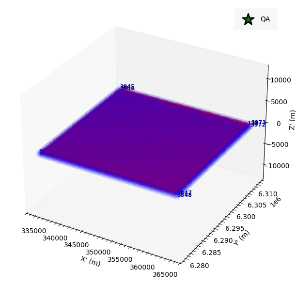
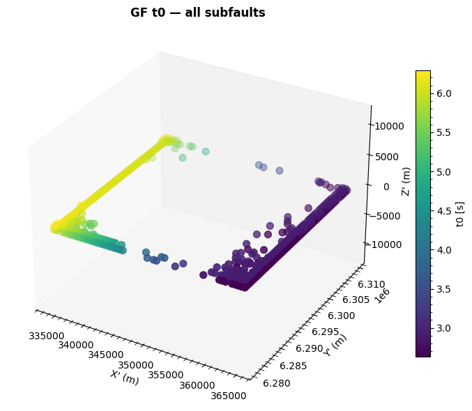
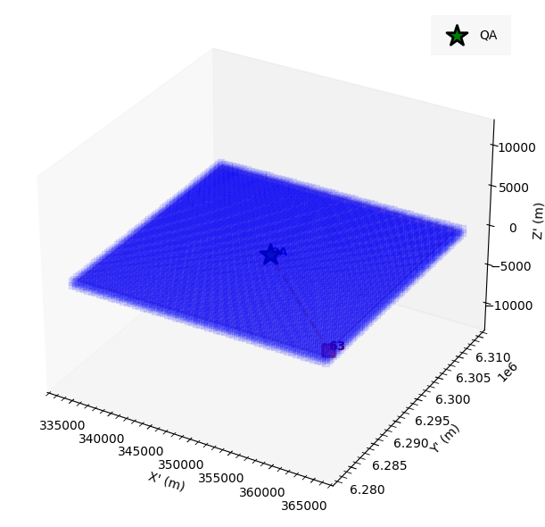
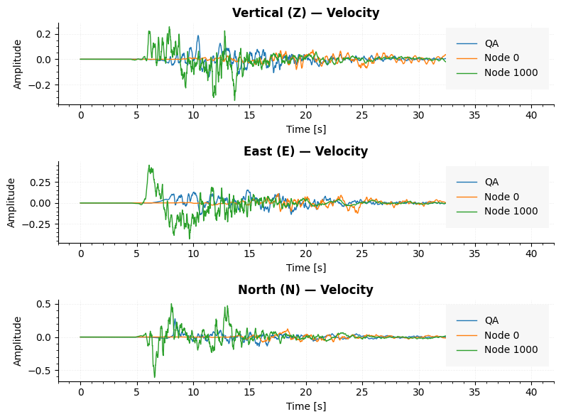
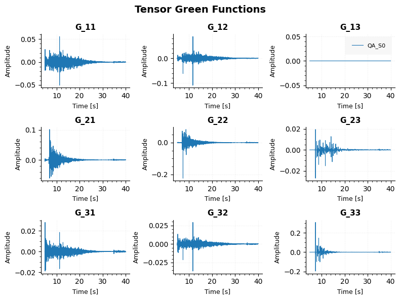
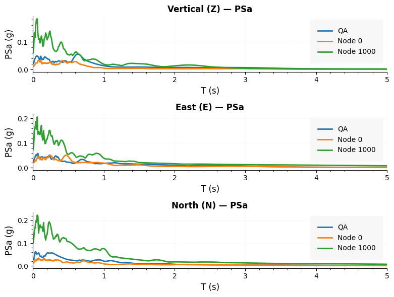
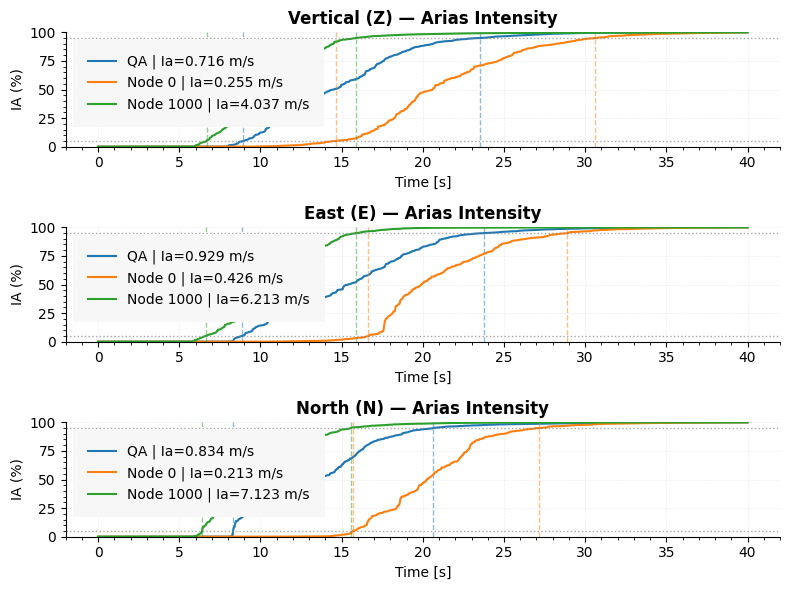
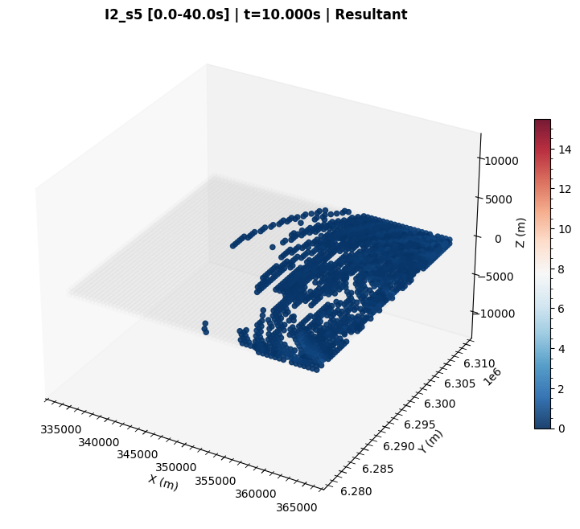
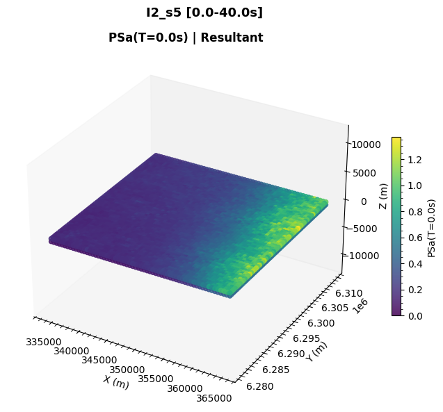
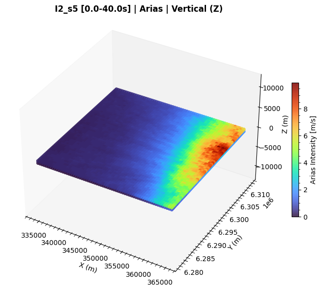

# Single-model plotting

Every plotting function is available as a **method** on `ShakerMakerData`, so the
examples below use `model_window`. Most figures are `3×1` (Z / E / N) and call
`plt.show()` directly; a few return data dictionaries (noted inline).

!!! tip "Inputs explained once"
    Inputs like `data_type`, `component`, `factor`, `node_id` / `target_pos`,
    `cmap`, and the animation knobs recur across every method. They are all
    defined in the **[Common parameters glossary](parameters.md)** — this page
    focuses on what each *figure* shows.

## Domain plots

### `plot_domain(xyz_origin=None, label_nodes=False, show_calculated=False, figsize=(8, 6), axis_equal=False)`
Plot the 3-D node domain (DRM box or surface grid), the QA node, and an optional
calculated-node overlay.

```python
model_window.plot_domain(label_nodes=False, show_calculated=False)
```

{ width="480" }

### `plot_domain_calculated_t0(subfault=0, show_calculated_only=False, xyz_origin=None, figsize=(8, 6), axis_equal=True, cmap="viridis")`
Color the domain by Green's Function `t0` for a selected subfault. Requires the
GF map and GF `t0`.

{ width="480" }

### `plot_gf_connections(node_id, xyz_origin=None, label_nodes=False, figsize=(8, 6), axis_equal=False)`
Show donor/receiver GF relationships for one node.

{ width="480" }

### `plot_calculated_vs_reused(db_filename=None, xyz_origin=None, label_nodes=False)`
Visualise which nodes are computed *donors* vs. *reused* receivers.

## Node plots

### `plot_node_response(node_id=None, target_pos=None, xlim=None, data_type="vel", figsize=(10, 8), factor=1.0, filtered=False)`
Plot time histories for one or more nodes.

```python
model_window.plot_node_response(node_id=10, data_type="vel")
```

{ width="480" }

### `plot_node_gf(node_id=None, target_pos=None, xlim=None, subfault=0, figsize=(8, 10), ffsp_source=None, strikes=None, dips=None, rakes=None, src_x=None, src_y=None, internal_ref=None, external_coord=None)`
Plot Green's Function time histories, optionally rotated to physical Z/E/N
components. Returns a dict `{'time', 'z', 'e', 'n'}`.

### `plot_node_tensor_gf(node_id=None, target_pos=None, xlim=None, subfault=0, figsize=(10, 8))`
Plot the full 9-component GF tensor. Returns a dict keyed by node label.

{ width="480" }

### `plot_node_newmark(node_id=None, target_pos=None, xlim=None, data_type="accel", figsize=(8, 10), factor=1.0, filtered=False, spectral_type="PSa")`
Plot Newmark response spectra for one or more nodes.

{ width="480" }

### `plot_node_arias(node_id=None, target_pos=None, data_type="accel", xlim=None, figsize=(10, 8), factor=1.0)`
Plot Arias intensity curves for one or more nodes.

{ width="480" }

!!! tip "Selecting nodes by position"
    Node methods accept either `node_id` (an index) or `target_pos` (a physical
    coordinate); the nearest node is resolved automatically.

## Surface plots

### `plot_surface(time=0.0, component="z", data_type="vel", cmap="RdBu_r", figsize=(12, 8), elev=30, azim=-60, s=20, alpha=0.85, axis_equal=False, interpolate=False, interp_method="linear", interp_resolution=300)`
3-D scatter snapshot of the whole domain at one simulation time.

{ width="480" }

### `plot_surface_newmark(T_target=0.0, component="z", data_type="accel", spectral_type="PSa", factor=1.0, cmap="hot_r", figsize=(12, 8), elev=30, azim=-60, s=20, alpha=0.85, axis_equal=False, n_jobs=-1)`
3-D map of spectral values at one target period `T`.

{ width="480" }

### `plot_surface_arias(component="z", data_type="accel", factor=1.0, cmap="hot_r", figsize=(12, 8), elev=30, azim=-60, s=20, alpha=0.85, axis_equal=False, n_jobs=-1)`
3-D map of Arias intensity across the domain.

{ width="480" }

## Map plots (geographic)

These overlay node data on real basemaps and need `folium` + geo utilities.

### `plot_surface_on_map(mapa, time=0.0, component="resultant", data_type="vel", factor=1, cmap="RdBu_r", thresh_pct=0.01, radius=3, fill_opacity=0.85, crs_utm="EPSG:32719")`
Overlay a single time snapshot on an existing Folium map. Returns the map object.

### `create_animation_map(...)`
Render a map animation overlaying node data on a tile basemap (writes an MP4).

## Animations

Both write an MP4 and require `ffmpeg`.

### `create_animation(time_start=0.0, time_end=None, n_frames=50, component="z", data_type="vel", cmap="RdBu_r", figsize=(12, 8), dpi=100, fps=10, elev=30, azim=-60, s=20, alpha=0.85, ffmpeg_path=None, output_dir="animation", output_video="animation.mp4", axis_equal=True, vmax_from_range=False)`
Render a full-domain 3-D scatter animation.

### `create_animation_plane(plane="xy", plane_value=0.0, time_start=0.0, time_end=None, n_frames=50, component="z", data_type="vel", cmap="RdBu_r", figsize=(12, 8), dpi=100, fps=10, elev=30, azim=-60, s=50, alpha=0.85, ffmpeg_path=None, output_dir="animation_plane", output_video="animation_plane.mp4", vmax_from_range=False, axis_equal=True)`
Render an animation for a single planar slice through the domain.

## Methods reference

| Method | Group | Returns |
|---|---|---|
| `plot_domain` | domain | `(fig, ax)` |
| `plot_domain_calculated_t0` | domain | `(fig, ax)` |
| `plot_gf_connections` | domain | shows figure |
| `plot_calculated_vs_reused` | domain | `(fig, ax)` |
| `plot_node_response` | node | shows figure |
| `plot_node_gf` | node | dict |
| `plot_node_tensor_gf` | node | dict |
| `plot_node_newmark` | node | shows figure |
| `plot_node_arias` | node | shows figure |
| `plot_surface` | surface | shows figure |
| `plot_surface_newmark` | surface | shows figure |
| `plot_surface_arias` | surface | shows figure |
| `plot_surface_on_map` | map | folium map |
| `create_animation` | animation | MP4 file |
| `create_animation_plane` | animation | MP4 file |
| `create_animation_map` | map | MP4 file |

## Reference

See the [Plotting API](../api/plotting.md).
