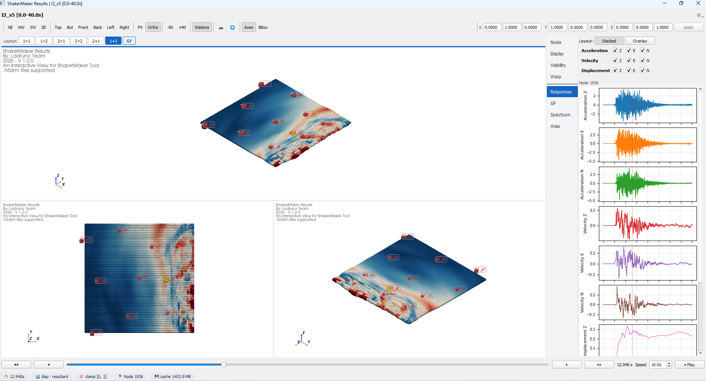

# Interactive viewer

The optional viewer is a **Qt + PyVista** application for inspecting a
`ShakerMakerData` model in 3-D: point clouds, displacement warp, vector fields,
static overlays (elevation / Newmark Sa / Arias), node picking, playback, and
docked matplotlib analysis panels.

Install the extras first:

```bash
pip install -e .[viewer]
```

## Launching

```python
session = model_window.viewer(show=True)
```

{ width="640" }

`model.viewer()` constructs a [`ViewerSession`](#viewersession) and, with
`show=True`, opens the Qt window. With `show=False` the session is a headless
data-access layer — scalars, traces, and spectra are served on demand with no GUI.

## Architecture at a glance

```text
ViewerSession                 <- orchestration / public API
  |-- ViewerDataAdapter       <- data + cache (HDF5, LRU series, GF tensors)
  |-- ViewerState             <- per-session display knobs
  |-- ViewerMainWindow        <- Qt window (only if show=True)
        |-- TabbedMultiViewArea -> ViewPane -> ViewerScene (+ PaneDisplayState)
        |-- side panel, toolbars, docks, trace panels, rupture tab
```

Every change flows through `session.set_*()` / `session.apply_*()`, which notify
the window; widgets subscribe and update. No widget pokes another widget
directly.

## `ViewerSession`

The orchestrator and the public API. Notebook users normally create it via
`model.viewer()` rather than instantiating directly.

```python
ViewerSession(
    model_or_adapter, *, show=False, field=None, demand="accel",
    component="resultant", time_index=0, selected_node=None, title=None,
    cache_time_series=True, max_cache_bytes=None, max_cache_entries=8,
)
```

### Driving the scene

The same actions the UI buttons trigger are available programmatically:

```python
session.set_demand("vel")          # accel / vel / disp / gf
session.set_component("z")          # z / e / n / resultant (g11..g33 for gf)
session.select_node(42)
session.set_warp_enabled(True)
session.set_colormap("RdBu_r")
session.set_playing(True)
```

| Group | Representative methods |
|---|---|
| **Time & playback** | `set_time_index` · `set_playing` · `toggle_playing` · `step_time` · `jump_time` · `set_playback_speed` |
| **Field & color** | `set_demand` · `set_component` · `set_colormap` · `set_color_range` · `set_clamp_enabled` · `set_show_scalar_bar` |
| **Selection** | `select_node` · `select_nearest_coordinate_m` · `clear_selection` · `add_nodes_to_multi_selection` · `toggle_node_in_multi_selection` · `set_selection_visibility` |
| **Warp** | `set_warp_enabled` · `set_warp_axes` · `set_warp_scale` · `set_ghost_warp_reference` |
| **Visibility** | `set_node_visibility` · `set_selection_labels_enabled` · `set_axes_grid_visible` |
| **Bulk apply** | `apply_display_settings` · `apply_warp_settings` · `apply_visibility_settings` · `apply_vector_field_settings` · `apply_static_color_settings` · `apply_panel_settings` |
| **Stations & transform** | `set_station_tags` · `set_show_station_tags` · `apply_display_transform` |
| **Lifecycle** | `show` · `close` |

### Reading current state

Query the live scene without touching it — useful headless:

```python
scalars = session.current_scalars()
vmin, vmax = session.current_color_limits()
spectrum = session.current_spectrum()
arias = session.current_arias()
info = session.current_node_info()
```

Other readers include `current_visible_points`, `current_warped_points`,
`current_vector_data`, `current_trace`, `current_accel_trace`,
`current_gf_tensor`, `current_time`, `current_visible_node_ids`,
`default_color_limits`, `suggested_warp_scale`, and `gf_subfault_count`.

## `ViewerState`

A validated dataclass holding every display knob: `demand`, `component`,
`time_index`, `colormap` (+ inversion / discrete bins / NaN & out-of-range
colors), legend layout, `selection_visibility`, warp (`disp_warp_enabled`,
`warp_axes`, `warp_scale`), vector-field settings, visibility toggles, and
playback. Each field has a typed setter that returns the canonical value. See the
[viewer API](../api/viewer.md#viewerstate) for the full field list.

## `ViewerDataAdapter`

The read/cache layer between the GUI and the model — the only piece that touches
HDF5. It serves per-frame scalar snapshots, caches full time-series with an LRU
budget, builds GF tensors, computes static overlays (elevation, Newmark-Sa,
Arias), and resolves node picks via a KDTree.

```python
ViewerDataAdapter(model, *, cache_time_series=True,
                  max_cache_bytes=None, max_cache_entries=8)
```

Highlights: `scalar_snapshot`, `scalar_series`, `prewarm_component_triplet`,
`trace`, `gf_tensor`, `spectrum`, `arias`, `nearest_node_id`,
`open_playback_handle` / `close_playback_handle`, and the `points` / `time` /
`available_demands` / `dataset_type` properties.

## Module map

| Module | Role |
|---|---|
| `session.py` | orchestration + public API |
| `state.py` | per-session display state |
| `adapter.py` | data + cache layer (HDF5) |
| `window.py` | Qt main window (menus, toolbars, docks, playback timer) |
| `multi_view.py` · `view_frame.py` | tabbed multi-viewport area + pane frames |
| `scene.py` | PyVista scene per pane (actors, overlays, HUD) |
| `pane_state.py` | per-pane overrides on top of `ViewerState` |
| `interaction.py` | custom VTK picking / rubber-band selection |
| `side_panel.py` · `properties_dock.py` | right-side editors and docks |
| `toolbar.py` · `controls.py` | themed toolbars and header / time controls |
| `information_panel.py` · `pipeline_browser.py` | info dock + scene tree |
| `trace_panel.py` | matplotlib Spectrum / Arias / Response / GF panels |
| `rupture_pane.py` · `rupture_adapter.py` | FFSP rupture tab + reader |
| `visual_editors.py` · `cmap_preview.py` | transfer-function / legend dialogs |
| `theme.py` · `colors.py` · `icons.py` · `busy_dialog.py` · `_imports.py` | theming, palettes, icons, progress dialog, optional-dep guard |

## Reference

See the [Interactive viewer API](../api/viewer.md).
